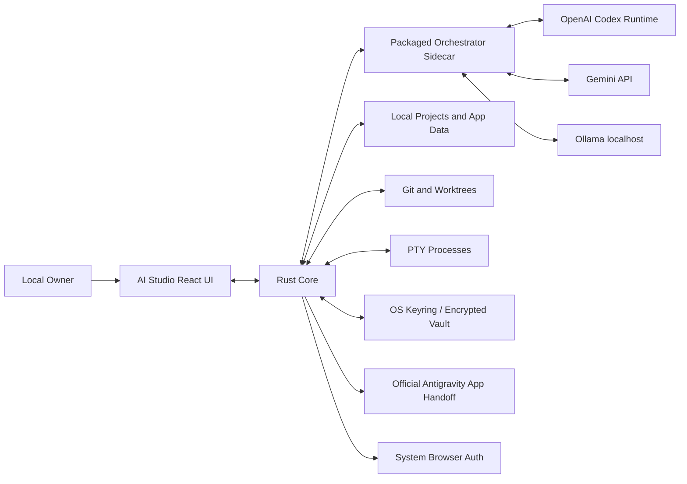
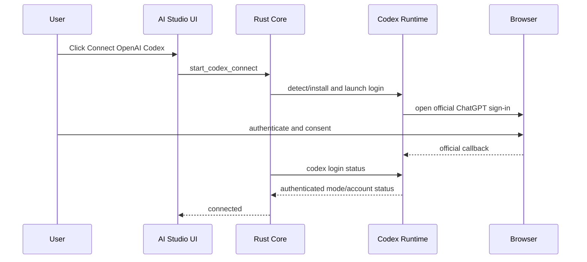
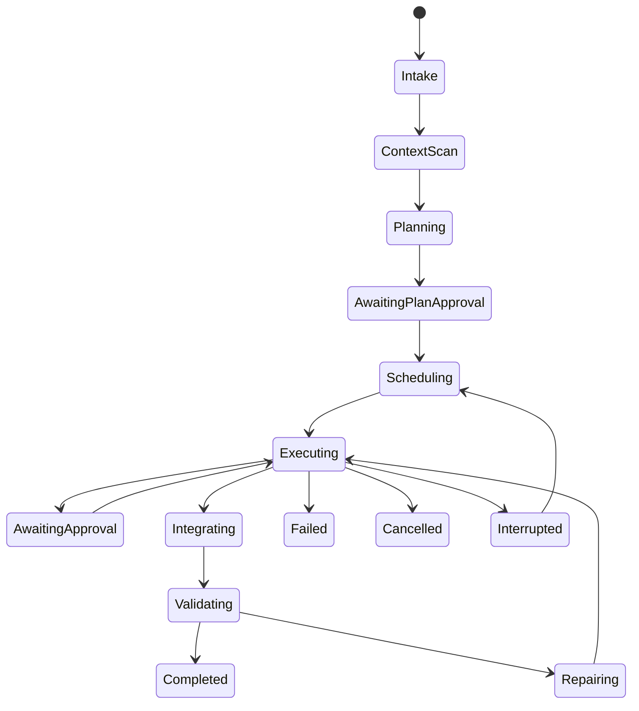
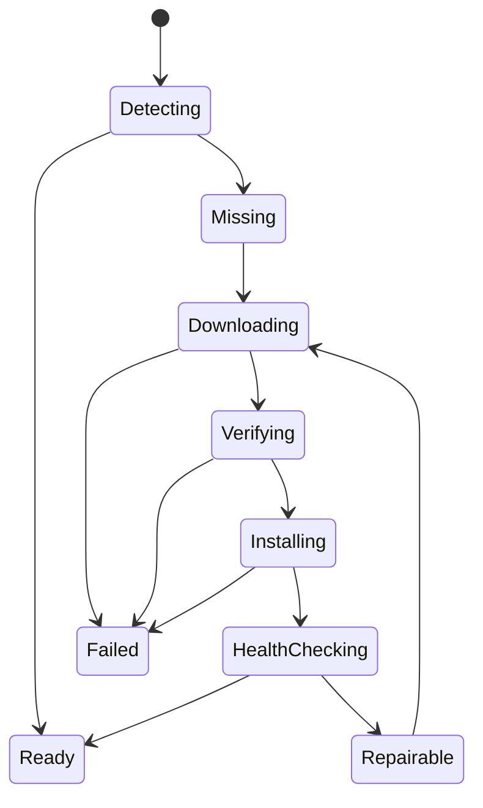

# AI Studio — Architecture Specification

**Status:** Binding technical architecture  
**Target:** Production desktop application, Windows-first  
**Research date:** 20 August 2026

---

## 1. Architectural Decision Summary

AI Studio will use a layered desktop architecture:

- **Tauri 2** for the native desktop shell, installer, native permissions, filesystem mediation, process management, updater, deep links, and OS integration.
- **React + TypeScript** for the UI.
- **Tailwind CSS and accessible component primitives** for styling.
- **A Rust Core** as the trusted local boundary for filesystem, Git, process, download, verification, secret-vault, backup, recovery, and PTY operations.
- **A packaged Node orchestration sidecar** for provider SDKs that require Node, including the OpenAI Codex TypeScript SDK, and for high-level task orchestration.
- **Typed stdio/JSON-RPC or a random-token localhost channel** for communication between the Rust Core and orchestration sidecar.
- **Local JSON/NDJSON state** managed by a single-writer persistence service.
- **Git branches and linked worktrees** for parallel write isolation.
- **Provider adapters** behind a common capability interface.

The browser/webview must never receive unrestricted shell, filesystem, or secret-store access. UI components request typed operations from the Rust Core. The Rust Core enforces capabilities, path scope, command policy, and approval state.

---

## 2. Why Tauri

Tauri fits the requirements because it combines a web frontend with a compiled Rust backend and native OS packaging. It supports external binaries/sidecars, scoped shell permissions, local filesystem APIs, Windows MSI/NSIS installers, and signed updates.

Tauri is preferred over Electron for this product because:

- the application needs a strong native trust boundary;
- background processes and local files are central;
- the app should not require a separately installed Node runtime;
- memory and installer footprint should remain controlled;
- Tauri capability policies provide a deliberate allowlist model.

A packaged Node sidecar is still used where ecosystem SDK compatibility makes it sensible. The user does not install Node.

---

## 3. System Context



Trust boundaries:

1. React UI is untrusted presentation logic.
2. Rust Core is the primary local authority.
3. Orchestrator sidecar is trusted application code but receives only scoped commands and secret handles.
4. Provider processes and external tools are isolated child processes.
5. Model output is untrusted input.
6. Project repositories may contain malicious instructions and files.

---

## 4. Repository Layout

```text
ai-studio/
├── apps/
│   ├── desktop-ui/
│   │   ├── src/
│   │   │   ├── app/
│   │   │   ├── components/
│   │   │   ├── features/
│   │   │   ├── hooks/
│   │   │   ├── stores/
│   │   │   ├── lib/
│   │   │   └── styles/
│   │   └── tests/
│   └── orchestrator/
│       ├── src/
│       │   ├── agents/
│       │   ├── providers/
│       │   ├── planning/
│       │   ├── routing/
│       │   ├── workflows/
│       │   ├── protocol/
│       │   └── validation/
│       └── tests/
├── src-tauri/
│   ├── src/
│   │   ├── commands/
│   │   ├── app_state/
│   │   ├── persistence/
│   │   ├── processes/
│   │   ├── pty/
│   │   ├── git/
│   │   ├── downloads/
│   │   ├── verification/
│   │   ├── providers/
│   │   ├── secrets/
│   │   ├── backups/
│   │   ├── recovery/
│   │   ├── security/
│   │   └── telemetry_local/
│   ├── capabilities/
│   ├── binaries/
│   └── tauri.conf.json
├── packages/
│   ├── contracts/
│   ├── schemas/
│   ├── provider-types/
│   ├── workflow-types/
│   ├── test-fixtures/
│   └── ui-tokens/
├── docs/
├── scripts/
├── tests/
│   ├── e2e/
│   ├── integration/
│   └── security/
├── PRD.md
├── architecture.md
├── design.md
└── rules.md
```

Use a workspace-capable package manager. Pin the package manager version. Lock dependency versions. Do not rely on globally installed build dependencies at runtime.

---

## 5. Runtime Components

### 5.1 React UI

Responsibilities:

- render all views and statuses;
- collect user input;
- subscribe to typed event streams;
- present approvals;
- maintain ephemeral view state;
- never directly access secrets;
- never execute arbitrary shell commands;
- never decide whether an operation is authorized.

Recommended UI state separation:

- server/native state: query cache with explicit invalidation;
- transient view state: small feature stores;
- persisted layout state: Rust persistence service;
- agent event streams: append/normalize into bounded stores.

### 5.2 Rust Core

Responsibilities:

- validate every frontend command;
- own app-data paths;
- own persistence writer and migrations;
- own secret storage;
- spawn and supervise sidecars/tools;
- mediate downloads and verification;
- execute approved Git operations;
- manage PTYs;
- watch project files;
- create backups and restore previews;
- reconcile crash state;
- emit sanitized events.

The Rust Core must use typed error codes, not unstructured strings as the contract.

### 5.3 Orchestrator sidecar

Responsibilities:

- provider SDK integration;
- task planning and decomposition;
- capability-aware provider routing;
- agent session lifecycle;
- structured-output validation;
- retry/fallback policy;
- context assembly;
- memory summarization;
- model event normalization.

The sidecar must be packaged as a self-contained binary or bundled runtime so the end user does not install Node. Tauri documents packaging Node applications as sidecars. The build pipeline must produce architecture-specific sidecar binaries.

### 5.4 Process Supervisor

Every long-running process receives:

- process ID and logical process ID;
- owner project/task/agent;
- executable identity;
- fixed or validated arguments;
- working directory;
- environment allowlist;
- stdout/stderr stream;
- start time and exit state;
- restart policy;
- cancellation token;
- graceful shutdown timeout;

Restart policy:

- no blind infinite restarts;
- exponential backoff with jitter;
- maximum attempt count;
- do not restart authentication failures;
- do not restart user-cancelled processes;
- persist crash reason.

---

## 6. Provider Abstraction

### 6.1 Core interface

```ts
export type ProviderId = "openai-codex" | "gemini" | "ollama" | "antigravity-handoff";

export interface ProviderAdapter {
  readonly id: ProviderId;
  readonly mode: "automatic" | "manual-handoff" | "local";

  detect(): Promise<ProviderDetection>;
  install?(request: InstallRequest): AsyncIterable<InstallEvent>;
  connect(request: ConnectRequest): AsyncIterable<ConnectionEvent>;
  disconnect(): Promise<void>;
  healthCheck(): Promise<ProviderHealth>;
  getCapabilities(): Promise<ProviderCapabilities>;
  listModels(): Promise<ModelDescriptor[]>;

  createSession(request: CreateSessionRequest): Promise<ProviderSession>;
  resumeSession(sessionId: string): Promise<ProviderSession>;
  run(request: ProviderRunRequest): AsyncIterable<NormalizedAgentEvent>;
  cancel(runId: string): Promise<void>;
}
```

Provider-specific raw events must be translated into normalized events before reaching feature/UI code.

### 6.2 Normalized event model

```ts
export type NormalizedAgentEvent =
  | { type: "run.started"; runId: string; at: string }
  | { type: "message.delta"; text: string; at: string }
  | { type: "reasoning.summary"; text: string; at: string }
  | { type: "tool.requested"; tool: ToolRequest; at: string }
  | { type: "tool.started"; invocationId: string; at: string }
  | { type: "tool.output"; invocationId: string; chunk: string; at: string }
  | { type: "file.changed"; change: FileChange; at: string }
  | { type: "approval.required"; approval: ApprovalRequest; at: string }
  | { type: "usage.updated"; usage: UsageSnapshot; at: string }
  | { type: "run.completed"; result: AgentResult; at: string }
  | { type: "run.failed"; error: PublicError; at: string };
```

### 6.3 Capability model

Do not assume all providers support all features.

```ts
export interface ProviderCapabilities {
  streaming: boolean;
  resumableSessions: boolean;
  structuredOutput: boolean;
  toolCalls: boolean;
  fileEditing: boolean;
  commandExecution: boolean;
  imageInput: boolean;
  webAccess: "none" | "provider-managed" | "tool-mediated";
  maxParallelRuns?: number;
  approvalEvents: boolean;
  modelSelection: boolean;
}
```

The orchestrator must construct workflows from capabilities. A disabled UI feature must explain the missing capability.

---

## 7. OpenAI Codex Adapter

### 7.1 Supported integration

Preferred order:

1. Codex SDK for local coding threads and automated runs.
2. Codex App Server over stdio for rich client functions such as authentication, approvals, thread history, and streamed events.
3. Codex MCP Server when the orchestrator needs Codex as a specialist inside a broader agent framework.

Use stdio for local App Server communication. The official documentation marks WebSocket transport as experimental/unsupported for production, so do not base the product on it.

### 7.2 Authentication

Connection sequence:



Rules:

- Do not read credential files.
- Do not display or copy auth tokens.
- Check status through official runtime commands/protocol.
- Support logout through official mechanism.
- Store only non-secret metadata: provider mode, timestamp, account label if officially returned, runtime version.

### 7.3 Installation

The runtime manager must:

- detect a compatible existing Codex installation;
- prefer an app-managed runtime when reproducibility requires it;
- download only from official OpenAI release locations;
- verify available checksums/signatures;
- record version and source;
- fall back to the official installer path when redistribution is not appropriate;
- never require the user to run npm globally.

Do not assume the TypeScript SDK automatically bundles every required runtime. Detect and test the final packaged build on a clean machine.

### 7.4 Session mapping

Store a local mapping:

```json
{
  "localSessionId": "sess_local_uuid",
  "provider": "openai-codex",
  "providerThreadId": "opaque-official-id",
  "projectId": "project_uuid",
  "agentId": "agent_uuid",
  "createdAt": "RFC3339",
  "lastUsedAt": "RFC3339"
}
```

Provider thread IDs are opaque. Never derive filesystem paths from them.

---

## 8. Gemini Adapter

### 8.1 Supported modes

- Gemini Developer API key.
- Google Cloud OAuth/Vertex mode when the implementation has a properly configured Google Cloud project and official desktop authorization flow.

Do not implement a fake “Sign in with Gemini subscription” button.

### 8.2 API-key onboarding

- Open the official AI Studio key page in the system browser.
- Explain why a key is required.
- Provide a paste field with clipboard convenience.
- Validate before saving.
- Save in Stronghold/OS credential store.
- Assign a secret handle such as `secret://provider/gemini/default`.
- Pass the key to the sidecar through inherited stdin, protected IPC, or process environment created at spawn time.
- Do not put the key in command-line arguments.

### 8.3 Model discovery

- Retrieve models dynamically.
- Cache with timestamp.
- Persist stable model IDs.
- Mark unavailable cached models.
- Filter by required capability.
- Never hardcode “best model” forever; model catalogs change.

### 8.4 Error mapping

Map provider errors into categories:

- invalid key
- quota exhausted
- billing required
- model unavailable
- content/safety block
- network failure
- timeout
- rate limit
- malformed request
- provider outage

Each category must offer a specific user action.

---

## 9. Antigravity Handoff Adapter

### 9.1 Hard boundary

Google’s official FAQ states that third-party software using an Antigravity login to access Antigravity violates its terms. Therefore:

- Do not invoke Antigravity headless mode using cached Antigravity credentials as an AI Studio provider.
- Do not inspect Antigravity’s keyring, config, token profiles, browser storage, or process memory.
- Do not proxy prompts into Antigravity behind the user’s back.

### 9.2 Allowed handoff design

The adapter is not a model provider. It is a workspace handoff utility.

It may:

- detect/install/open the official Antigravity app or CLI;
- generate a task packet in the project;
- copy prompt text to clipboard;
- open the project/worktree in Antigravity;
- watch the user-authorized project files and Git changes;
- import resulting diffs and artifacts into AI Studio;
- mark the task as waiting for external completion.

Handoff packet:

```text
.ai-studio/handoffs/<handoff-id>/
├── PROMPT.md
├── CONTEXT.md
├── EXPECTED_OUTPUT.json
├── FILES.json
├── WORKTREE.json
└── STATUS.json
```

The user must see the mode label **Manual Handoff** at all times.

---

## 10. Ollama Adapter

- Detect localhost service at the documented default endpoint.
- Install through official user-scoped installer where supported.
- Do not expose Ollama beyond localhost.
- Retrieve installed model list dynamically.
- Show model disk size before pull.
- Stream pull progress.
- Support cancel and retry.
- Run a hardware-fit advisor based on RAM, VRAM, disk, and requested context.
- Keep local and cloud Ollama modes visibly distinct; local mode needs no local API authentication, cloud mode does.

The first-run flow must not automatically download a multi-gigabyte model without explicit approval.

---

## 11. Orchestration Engine

### 11.1 Workflow stages



### 11.2 Task graph

```ts
export interface WorkflowTask {
  id: string;
  title: string;
  description: string;
  role: AgentRole;
  dependencies: string[];
  status: TaskStatus;
  risk: "low" | "medium" | "high";
  writeScope: string[];
  expectedOutputs: OutputContract[];
  validation: ValidationStep[];
  assignedProvider?: ProviderId;
  assignedModel?: string;
  worktreeId?: string;
}
```

Validate that the graph is acyclic before execution.

### 11.3 Scheduler

Constraints:

- provider parallelism limits;
- project-level maximum parallel agents;
- system CPU/RAM pressure;
- task dependencies;
- write-scope overlap;
- user pause state;
- budget/usage guardrails;
- approval state.

Default max write-capable agents should be conservative. More agents are not automatically more useful; they are merely more simultaneous opportunities for nonsense.

### 11.4 Agent context assembly

Context is assembled from explicit sources:

- user prompt;
- PRD/project instructions;
- repository tree summary;
- relevant files selected by retrieval;
- task dependencies and outputs;
- project decisions;
- role rules;
- tool policy;
- expected output schema.

Do not dump the entire repository blindly into every prompt.

### 11.5 Output validation

Every task must define one or more validators:

- JSON schema validation;
- file existence;
- typecheck;
- lint;
- tests;
- build;
- diff constraints;
- security checks;
- human approval.

A model’s sentence “done” is not a completion signal.

---

## 12. Git and Worktree Architecture

### 12.1 Branch naming

```text
ai-studio/<project-short-id>/<agent-role>/<task-short-id>
```

Sanitize all names. Use IDs to avoid collisions.

### 12.2 Worktree layout

```text
<project-parent>/.ai-studio-worktrees/<project-id>/<task-id>/
```

Do not place linked worktrees inside a path ignored or deleted by the project’s own build scripts without deliberate protection.

### 12.3 Integration flow

1. Ensure clean or snapshot-known base.
2. Create branch and worktree.
3. Run agent in that worktree.
4. Validate.
5. Commit with machine-generated metadata and human-readable summary.
6. Integrator previews diff.
7. Merge/cherry-pick into integration branch.
8. Run full validation.
9. Merge into user branch after approval policy.
10. Remove worktree only after clean-state verification.

### 12.4 Destructive Git operations

The app must require explicit approval for:

- reset --hard
- clean with deletion
- force push
- branch deletion with unmerged commits
- history rewrite
- remote deletion

Never hide these inside a generic “fix Git” action.

---

## 13. Persistence Architecture

### 13.1 Single writer

Only the Rust persistence service writes canonical state files. UI and sidecar send commands/events. This prevents multi-process JSON corruption.

### 13.2 Data envelope

```json
{
  "schemaVersion": 1,
  "revision": 42,
  "writtenAt": "2026-08-20T12:00:00Z",
  "checksum": "sha256:...",
  "data": {}
}
```

### 13.3 Write algorithm

1. Validate against schema.
2. Serialize deterministically.
3. Write to sibling temporary file.
4. Flush file.
5. Optionally flush parent directory where supported.
6. Rotate current file to `.previous` when required.
7. Atomic rename temp to final.
8. Update revision index.
9. Emit persistence success event.

### 13.4 Event journal

Use `events.ndjson` for high-frequency events:

```json
{"seq":1,"at":"...","type":"task.created","payload":{}}
{"seq":2,"at":"...","type":"agent.started","payload":{}}
```

- monotonically increasing sequence per project;
- append-only;
- flush at safe intervals;
- compact into snapshots;
- retain original segment files for configurable duration.

### 13.5 Locking

- Acquire an application instance lock for canonical state.
- If a second instance is allowed, it must operate read-only or communicate with the first instance.
- Project locks include owner process and heartbeat.
- Stale locks are reconciled using process existence and timestamps.

### 13.6 Migrations

Each migration:

- has source/target schema versions;
- creates a backup;
- is idempotent or detects completion;
- validates output;
- records a migration receipt;
- never deletes the only previous copy.

---

## 14. Secrets Architecture

Use OS-native secure storage or Tauri Stronghold.

Rules:

- JSON stores secret references, not secret values.
- Frontend receives masked metadata only.
- Sidecar requests a scoped secret lease from Rust.
- Secret is transmitted only to the intended provider operation.
- Secret never appears in logs, exception messages, command arguments, URLs, analytics, or backup by default.
- Clipboard is cleared only when user opts in; do not destructively clear unrelated clipboard content.
- Disconnect deletes or revokes the local stored secret as appropriate.

Example metadata:

```json
{
  "provider": "gemini",
  "secretRef": "secret://provider/gemini/default",
  "lastValidatedAt": "...",
  "displayHint": "••••abcd"
}
```

---

## 15. One-Click Bootstrap Architecture

### 15.1 Setup manifest

Define an app-controlled manifest:

```json
{
  "tool": "agy",
  "platform": "windows-x86_64",
  "version": "resolved-version",
  "source": "official-allowlisted-url",
  "sha256": "optional-required-when-published",
  "installMode": "official-script-or-user-installer",
  "healthCheck": ["agy", "--version"]
}
```

The manifest itself must be signed when delivered remotely.

### 15.2 Installation states



### 15.3 User experience requirements

- No raw terminal window for routine setup.
- Show progress and current action.
- Show a detailed log behind **View details**.
- Request elevation only when unavoidable and explain why.
- Resume interrupted downloads.
- Detect successful external installer completion automatically.
- Provide safe rollback.

### 15.4 Legal/licensing gate

Before bundling any external runtime:

- verify license and redistribution permission;
- include required notices;
- otherwise use official download/installer;
- never copy a provider’s private application binaries.

---

## 16. Terminal and PTY

Use xterm.js in the frontend and a Rust PTY library/backend.

Protocol messages:

- create terminal
- input bytes
- output bytes
- resize
- change title
- exit
- kill

Security:

- terminal IDs are random and scoped to a window/project;
- validate working directory;
- do not render clickable escape-sequence links without sanitization/policy;
- cap scrollback;
- sanitize copied secret-like output only in diagnostics, not by silently mutating visible terminal output.

---

## 17. Preview Server Architecture

- Detect package scripts and framework defaults.
- Start via Process Supervisor.
- Bind to `127.0.0.1` by default.
- Allocate port through the OS to avoid race conditions.
- Use a health probe.
- Embed preview only from allowed localhost origins.
- Apply CSP and navigation restrictions.
- Open external browser as fallback.
- Never permit project HTML to invoke privileged Tauri APIs; preview must run in an unprivileged window/webview.

---

## 18. IPC and Contracts

All IPC contracts live in shared schema packages.

Example Rust command request:

```ts
interface StartTaskRequest {
  projectId: string;
  taskId: string;
  expectedRevision: number;
}
```

Requirements:

- runtime schema validation on both boundaries;
- request IDs;
- cancellation;
- bounded payload sizes;
- no arbitrary command string endpoint;
- version negotiation with sidecar;
- sanitized public errors.

Forbidden API:

```ts
invoke("run_any_command", { command: userOrModelString });
```

Required pattern:

```ts
invoke("run_approved_tool", {
  toolId: "git.status",
  projectId,
  args: { porcelain: true }
});
```

---

## 19. Security Model

### 19.1 Main threats

- prompt injection from repository files;
- malicious package scripts;
- arbitrary shell execution;
- path traversal;
- secret exfiltration;
- localhost service exposure;
- poisoned runtime download;
- unsafe update;
- privilege escalation;
- destructive Git commands;
- model-generated social engineering in approval text.

### 19.2 Controls

- treat model text as untrusted;
- separate tool request fields from model explanation;
- fixed tool catalog;
- command parser/allowlist;
- canonical path checks;
- project-root scopes;
- network domain policy;
- approval engine;
- secret broker;
- download allowlist and verification;
- signed updates;
- localhost-only services;
- content security policy;
- audit journal.

### 19.3 Approval object

```ts
interface ApprovalRequest {
  id: string;
  category: ApprovalCategory;
  actor: { agentId: string; taskId: string };
  operation: StructuredOperation;
  reason: string;
  riskSummary: string;
  affectedResources: string[];
  reversible: boolean;
  expiresAt?: string;
}
```

The model does not control the displayed operation fields. They are generated from the actual tool invocation.

---

## 20. Backup and Recovery Architecture

### 20.1 Backup archive

```text
backup.ai-studio.zip
├── manifest.json
├── app/
├── projects/
├── checksums.json
└── optional-secrets.enc
```

- use a deterministic manifest;
- include schema versions;
- hash every entry;
- exclude caches, downloaded models, node_modules, and build outputs by default;
- optionally include project source or references based on user choice.

### 20.2 Crash recovery

Startup reconciliation:

1. Validate app-state checksum.
2. Fall back to previous snapshot if invalid.
3. Read event journal after snapshot revision.
4. Detect stale process records.
5. Inspect worktrees and Git status.
6. Mark uncertain tasks Interrupted.
7. Rebuild UI state.
8. Offer safe resume.

Never infer task completion solely because a child process no longer exists.

---

## 21. Update and Distribution

### 21.1 Windows output

Produce:

- NSIS setup executable or MSI according to chosen update strategy;
- Start menu entry;
- optional desktop shortcut;
- uninstall entry;
- user-scoped installation where practical;
- signed binaries for release builds.

### 21.2 Updater

- signed update metadata;
- signed artifacts;
- staged download;
- release notes;
- restart-to-install;
- failure rollback or preserved prior installer;
- no update from model-supplied URL.

### 21.3 CI

CI must build and test:

- TypeScript typecheck;
- lint;
- Rust fmt/clippy/test;
- unit tests;
- contract tests;
- provider mocks;
- installer build;
- clean-machine smoke test;
- secret scanning;
- dependency/license report;
- update signature validation.

---

## 22. Testing Architecture

### Unit tests

- reducers/stores;
- schemas;
- event normalization;
- scheduler;
- path policies;
- command policies;
- migration functions;
- backup manifests;
- error mapping.

### Integration tests

- UI ↔ Rust IPC;
- Rust ↔ sidecar protocol;
- process supervision;
- PTY;
- Git worktrees;
- JSON atomic writes;
- crash recovery;
- secret broker;
- provider adapters against mocks/recorded fixtures.

### End-to-end tests

- first launch;
- provider setup mock;
- project creation;
- two-agent parallel run;
- approval flow;
- merge conflict;
- preview start;
- force-kill/recovery;
- backup/restore;
- update rejection on invalid signature.

### Clean-machine acceptance

Use a Windows VM with no Node, Rust, Git, Codex, Antigravity, or Ollama installed. Verify the graphical journey and document any unavoidable official installer step.

---

## 23. Architecture Decision Records Required

Create ADRs for:

1. Tauri versus Electron.
2. Rust Core plus Node sidecar.
3. stdio versus localhost IPC.
4. JSON/NDJSON persistence.
5. Stronghold/OS keyring.
6. Git worktree isolation.
7. Codex SDK/App Server selection.
8. Antigravity handoff restriction.
9. updater and code-signing approach.
10. preview webview isolation.

---

## 24. Official References

- https://developers.openai.com/codex/auth
- https://developers.openai.com/codex/codex-sdk
- https://developers.openai.com/codex/app-server
- https://developers.openai.com/codex/mcp-server
- https://antigravity.google/docs/faq/
- https://antigravity.google/docs/cli/install
- https://antigravity.google/docs/cli/headless
- https://ai.google.dev/gemini-api/docs/get-started
- https://ai.google.dev/gemini-api/docs/oauth
- https://v2.tauri.app/concept/architecture/
- https://v2.tauri.app/develop/sidecar/
- https://v2.tauri.app/learn/sidecar-nodejs/
- https://v2.tauri.app/plugin/shell/
- https://v2.tauri.app/plugin/file-system/
- https://v2.tauri.app/plugin/stronghold/
- https://v2.tauri.app/plugin/updater/
- https://v2.tauri.app/distribute/windows-installer/
- https://docs.ollama.com/api/introduction
- https://docs.ollama.com/api/authentication
- https://git-scm.com/docs/git-worktree
- https://xtermjs.org/docs/
